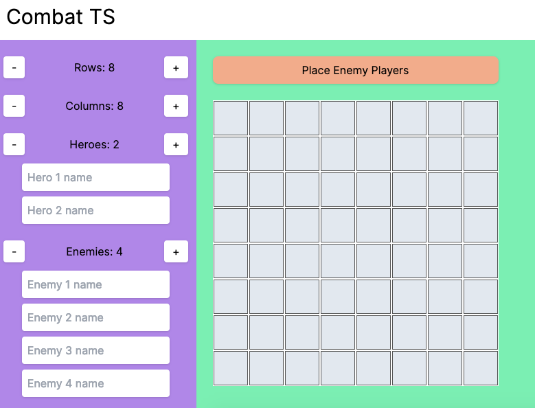

# Combat TS

An interactive battle map for tabletop RPGs. Based on [boardgame.io](https://boardgame.io).

### Features

- [x] Customizable map size
- [x] Selectable number of players (heroes and enemies)
- [ ] Customized view for each player based on their stats and abilities
- [ ] GM view showing secret data players don't know about yet (hidden enemies, traps, etc.)
- [ ] Like a jillion other things, I just started this project.

<p align="center">
  
</p>

### Contributing

Fork it, send a PR. Let's collab.

```
git clone <repo>
cd <repo>
npm run dev
```
